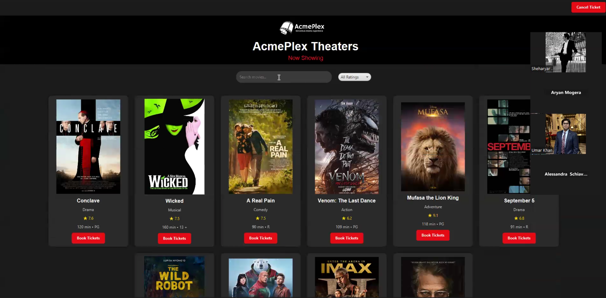
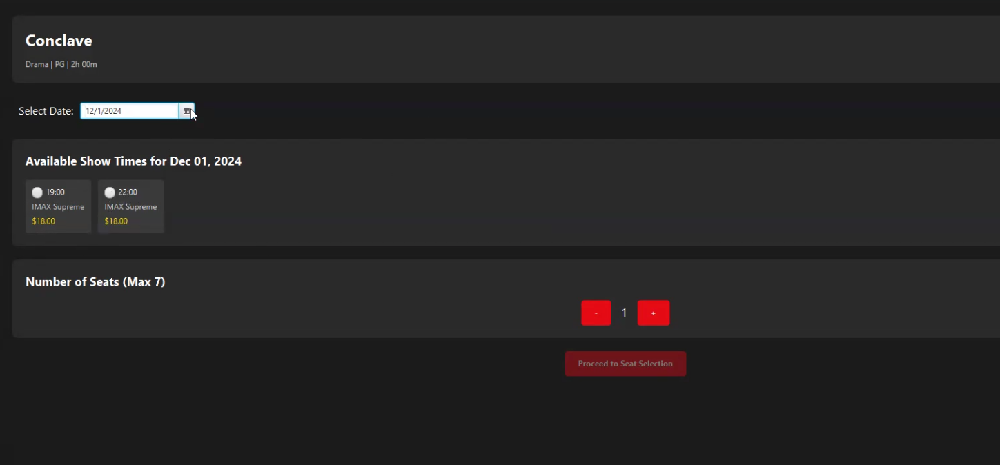
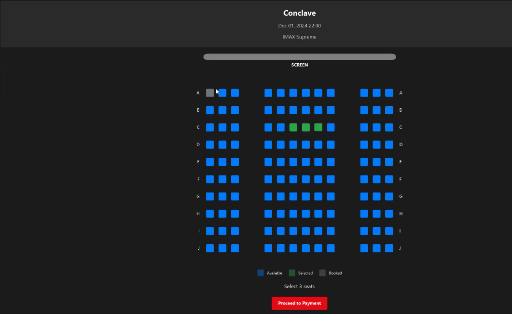
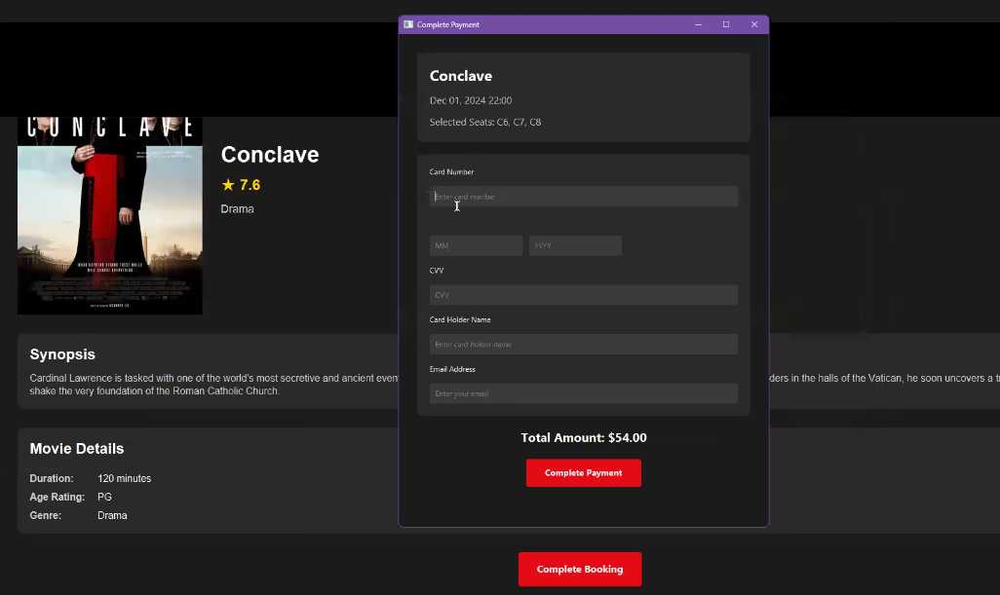
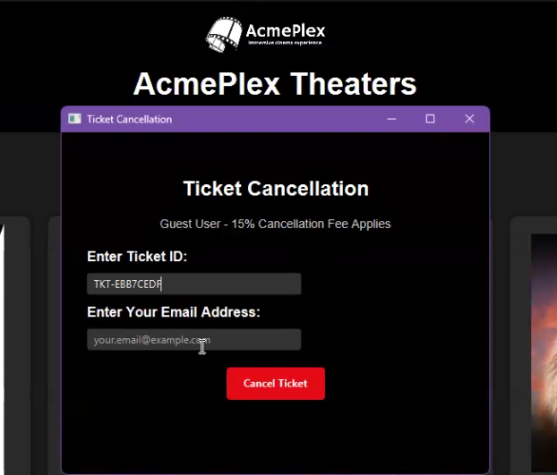
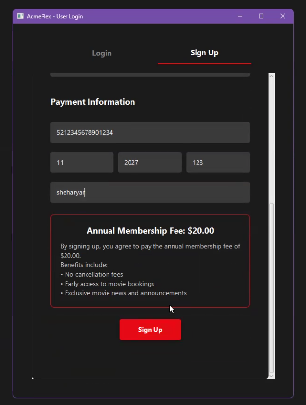
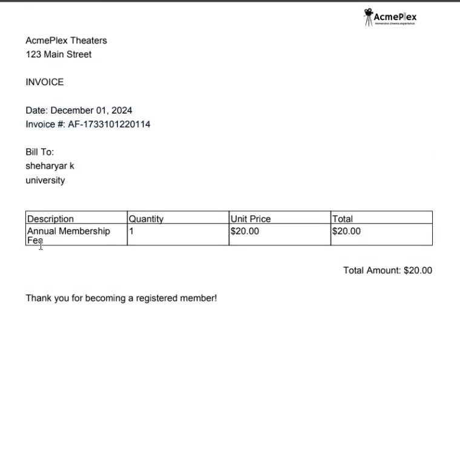
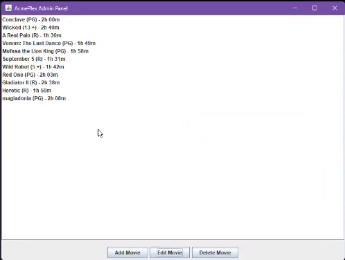

# AcmePlex Movie Theater Ticket Reservation System

A comprehensive movie theater ticket reservation system built with Java and JavaFX, featuring both user and admin interfaces for managing movie bookings, user accounts, and theater operations.


## Screenshots from the GUI


*The movies populated in the main GUI*


*The movie shotime being fetched*

*Interactive Seat Map GUI*

*Bank Payment Gateway*



*Ticket Cancellation Refund*


*Membership Signup*



*PDF email invoice*





## 📋 Table of Contents
- [Features](#features)
- [Technology Stack](#technology-stack)
- [Prerequisites](#prerequisites)
- [Project Structure](#project-structure)
- [Installation & Setup](#installation--setup)
  - [Windows Setup](#windows-setup)
  - [MacOS Setup](#macos-setup)
- [Running the Application](#running-the-application)
- [Database Setup](#database-setup)
- [Testing](#testing)
- [Contributing](#contributing)
- [License](#license)

## 🎯 Features

### Customer Features
- Browse available movies with detailed information
- View movie showtimes and seat availability
- Select and book seats with interactive seat map
- Secure payment processing
- Email confirmation with tickets and receipts
- Ticket cancellation with refund processing
- Registered user benefits (early access, no cancellation fees)

### Admin Features
- Movie management (add, edit, delete)
- Show time management
- Seat availability monitoring
- User account management
- Booking oversight

## 💻 Technology Stack

- **Backend**: Java
- **Frontend**: JavaFX
- **Database**: MySQL
- **Email Service**: JavaMail API
- **Build Tool**: Pure Java (no build tools)
- **IDE**: VS Code with Java extensions

## 🔧 Prerequisites

- JDK (Latest version recommended)
- VS Code with Java extensions
- MySQL Server
- JavaFX SDK:
  - Windows: JavaFX SDK 13
  - MacOS: JavaFX SDK 22 (ARM compatible)

## 📁 Project Structure

```
project-root/
├── .vscode/                  # VS Code configuration
├── assets/                   # Images and resources
├── bin/                      # Compiled files
├── lib/                      # Dependencies
│   ├── javafx-sdk-13/       # JavaFX for Windows
│   ├── javafx-sdk-22/       # JavaFX for MacOS
│   └── *.jar                # Other dependencies
├── src/                      # Source code
└── tests/                    # JUnit tests
```

### Required JAR Dependencies
- mysql-connector-j-9.1.0.jar
- junit-platform-console-standalone-1.11.3.jar
- javax.mail.jar
- jakarta.activation-1.2.2.jar
- javax.activation-api-1.2.0.jar
- JavaFX Libraries (SDK Version 13 for Windows, SDK Version 22 for MacOS)

## 🚀 Installation & Setup

### Windows Setup

1. Create a new Java project in VS Code
2. Download and extract provided ZIP files:
   - `26Java.zip` (Source code)
   - `26dependencies.zip` (Libraries)
   - `26config.zip` (VS Code configuration)
   - `26asset.zip` (Images and resources)
3. Replace/merge the extracted folders with your project structure
4. Configure JavaFX SDK 13 path in `.vscode/settings.json` and `launch.json`

### MacOS Setup

Follow Windows setup with these differences:
1. Use JavaFX SDK 22 instead of SDK 13
2. Use MacOS-specific `settings.json` and `launch.json` from the config folder
3. Update JavaFX path using MacOS conventions:
```json
"vmArgs": "--module-path MovieReservationApp/lib/javafx-sdk-22/lib --add-modules javafx.controls,javafx.fxml,javafx.graphics"
```

## ▶️ Running the Application

1. Open project in VS Code
2. Ensure all dependencies are properly referenced
3. Run the application using either:
   - Debug button
   - Run button on any Java source file
4. Choose between:
   - Main GUI (Customer Interface)
   - Admin GUI (Administrative Interface)

## 🗄️ Database Setup

1. Execute SQL queries from `MySQLQueries.txt`
2. Update database connection settings in `DatabaseConnection.java`:
```java
private static final String DB_URL = "jdbc:mysql://localhost:3306/MovieTheater";
private static final String DB_USER = "movieadmin";
private static final String DB_PASSWORD = "password";
```

## 🧪 Testing

- Sample test card numbers available in `Sample Card Info.txt`
- Test movie poster URLs included for admin testing
- JUnit tests available in the `tests` directory

## 🤝 Contributing

1. Fork the repository
2. Create a new branch
3. Make your changes
4. Submit a pull request

## 📝 License

This project is licensed under the MIT License - see the LICENSE file for details.

## 🚨 Common Issues

- If you encounter "JavaFX runtime components are missing" error, verify JavaFX SDK path configuration in VS Code settings
- For MacOS Apple Silicon users, ensure using JavaFX SDK 22 or higher
- Database connection issues: verify MySQL server is running and credentials are correct

